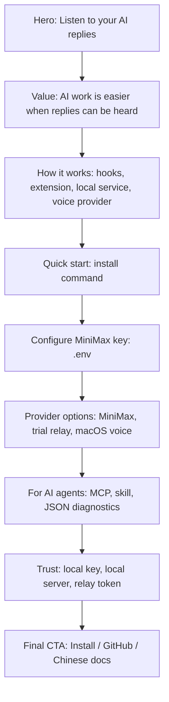
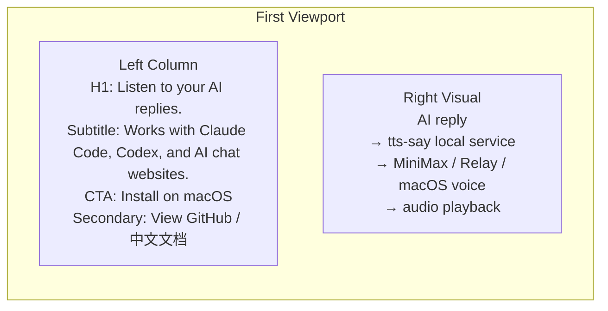
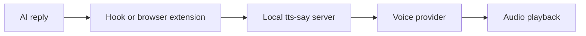

# tts-say Website PRD

## 1. 产品背景

tts-say 是一个 macOS 本地工具，让 AI 回复自动朗读出来。它连接 Claude Code、Codex 和常见 AI 聊天网页，把原本需要长时间阅读的 AI 回复扩展成可听的工作流。

网页的目标是帮助新用户快速理解价值、建立信任，并完成安装。

## 2. 页面目标

### 业务目标

- 清楚表达 tts-say 的核心价值：让 AI 回复变成声音。
- 让 macOS 用户能在 3 分钟内完成安装尝试。
- 引导用户理解 MiniMax key、trial relay、macOS 系统语音三种体验方式。
- 展示项目对 AI agent 友好：MCP、skill、结构化诊断。

### 用户目标

- 判断这个工具是否适合自己的 AI 使用场景。
- 了解它支持哪些入口：Claude Code、Codex、Chrome AI 聊天网页。
- 按步骤安装并听到第一段语音。
- 明白 key 存在哪里，以及 trial relay 如何保护 provider key。

## 3. 目标用户

- 每天高频使用 AI 的开发者、研究员、产品经理、内容创作者和学生。
- 使用 Claude Code、Codex、ChatGPT、Claude、Gemini、DeepSeek、豆包、Kimi 的 macOS 用户。
- 希望减少阅读负担、保留现有工作方式的人。
- 想让自己的 LLM agent 帮忙安装、诊断和维护本地工具的人。

## 4. 核心定位

### 英文主张

> Listen to your AI replies.

### 中文主张

> 让 AI 回复自动读出来。

### 支撑表达

> tts-say reads AI responses aloud across Claude Code, Codex, and AI chat websites, so your AI workflow becomes readable and listenable.

## 5. 信息架构



## 6. 首屏线框



### 首屏要求

- H1 必须直接表达产品价值。
- CTA 直接给安装路径，避免先进入营销页面。
- 右侧视觉使用流程图、终端片段、聊天气泡和音频波形组合。
- 首屏底部露出下一节标题，提示页面继续讲价值。

## 7. 页面模块需求

### 7.1 Hero

目的：5 秒内说明产品做什么。

内容：

- H1: `Listen to your AI replies.`
- Subtitle: `tts-say reads AI responses aloud across Claude Code, Codex, and AI chat websites.`
- Primary CTA: `Install on macOS`
- Secondary CTA: `View GitHub`
- Utility link: `中文文档`

视觉：

- 终端命令块
- AI 聊天气泡
- 音频波形
- 本地服务流程箭头

### 7.2 Value

标题：

`AI work is easier when replies can be heard.`

三张价值卡：

- `Rest your eyes during long AI sessions`
- `Keep typing and working as usual`
- `Hear long answers while coding, researching, or writing`

中文备选：

- `长时间使用 AI 时减轻阅读负担`
- `保留原来的打字和工作方式`
- `写代码、研究、写作时听 AI 回复`

### 7.3 How It Works

流程：



入口说明：

- Claude Code Stop hook: 读取最后一条 assistant 消息。
- Codex notify hook: 回合结束后朗读最后回复。
- Chrome extension: 监听 AI 网页回复稳定后发送到本地服务。

### 7.4 Quick Start

目的：让用户马上安装。

内容：

```sh
git clone https://github.com/liteli1987gmail/tts-say.git
cd tts-say
./install.sh
```

旁边放系统要求：

- macOS
- Python 3
- `afplay`
- `say`
- Google Chrome for browser extension

### 7.5 Configure MiniMax Key

目的：单独解释 key 配置方式。

内容：

```sh
cp .env.example .env
```

说明：

- 打开 `.env`。
- 填入自己的 `MINIMAX_API_KEY`。
- 留空时可用 macOS 系统语音完成 first-run demo。
- `.env` 被 `.gitignore` 忽略。

### 7.6 Provider Options

| Mode | Use Case | User Setup |
|---|---|---|
| MiniMax key | 最佳音色 | `.env` 填 `MINIMAX_API_KEY` |
| Trial relay | 产品试用 | `.env` 填 `TTS_SAY_RELAY_URL` 和 `TTS_SAY_TRIAL_TOKEN` |
| macOS voice | first-run demo | 无需 key |

### 7.7 For AI Agents

标题：

`Built for humans and AI agents.`

内容：

- MCP server: `mcp/tts_say_mcp.py`
- Skill: `skills/tts-say-installer`
- JSON diagnostics: `doctor.sh --json --pretty`

工具列表：

- `doctor`
- `install`
- `install_chrome_extension`
- `uninstall`
- `start_service`
- `stop_service`
- `play_test_audio`
- `get_logs`

### 7.8 Trust

标题：

`Local-first by default.`

正向表达：

- API keys stay in local `.env`.
- Chrome extension talks to `127.0.0.1`.
- Trial relay uses tokens for product trials.
- Diagnostics report key presence only.

### 7.9 Final CTA

内容：

- `Install on macOS`
- `View GitHub`
- `Read Chinese docs`

## 8. 交互需求

- CTA 点击后滚动到 Quick Start。
- 代码块提供复制按钮。
- 中英文文档互相跳转。
- Provider 表格在移动端变成分组卡片。
- How It Works 流程在移动端纵向排列。
- Chrome extension 安装说明支持展开 “manual steps”。

## 9. 视觉方向

### 关键词

- Quiet productivity
- Local-first
- Developer-friendly
- Clear, calm, precise

### 风格

- 背景：白色或极浅灰
- 主文字：深墨色
- 强调色：蓝绿色或电光青，表达声音和连接
- 元素：终端、聊天气泡、流程箭头、音频波形

### 字体

- 英文：Inter 或 system font
- 中文：system font
- 代码：SF Mono / Menlo

## 10. 内容原则

- 正面表达产品是什么。
- 避免把页面写成 README 长文。
- 安装、key 配置、provider 选择分开解释。
- 不使用夸张营销词。
- 不展示真实 API key。

## 11. SEO 与元信息

### Title

`tts-say — Listen to AI replies across Claude Code, Codex, and AI chat websites`

### Description

`tts-say is a macOS local tool that reads AI responses aloud through Claude Code hooks, Codex notify hooks, and a Chrome extension for AI chat websites.`

### Keywords

- AI text to speech
- Claude Code TTS
- Codex TTS
- ChatGPT read aloud
- MiniMax TTS
- macOS TTS tool

## 12. 成功指标

- GitHub README 到安装命令的点击或复制率。
- `install.sh` 完成率。
- `doctor.sh` 通过率。
- Chrome 扩展加载完成率。
- 首次播放成功率。
- 用户进入 provider 配置区域的比例。

## 13. MVP 范围

### 必须有

- Hero
- Value
- How It Works
- Quick Start
- Configure MiniMax Key
- Provider Options
- For AI Agents
- Trust
- Final CTA

### 后续增强

- 在线 demo 视频
- Chrome extension 安装截图
- MiniMax relay 试用申请入口
- 常见问题
- 多语言切换

## 14. 开发备注

- 当前仓库可先做静态站点。
- 页面可从 README 内容提炼，不直接复制 README。
- 首屏视觉建议用 HTML/CSS 实现，不依赖真实产品截图。
- 如果后续使用 Sites 部署，生产 CTA 指向 GitHub 仓库。
